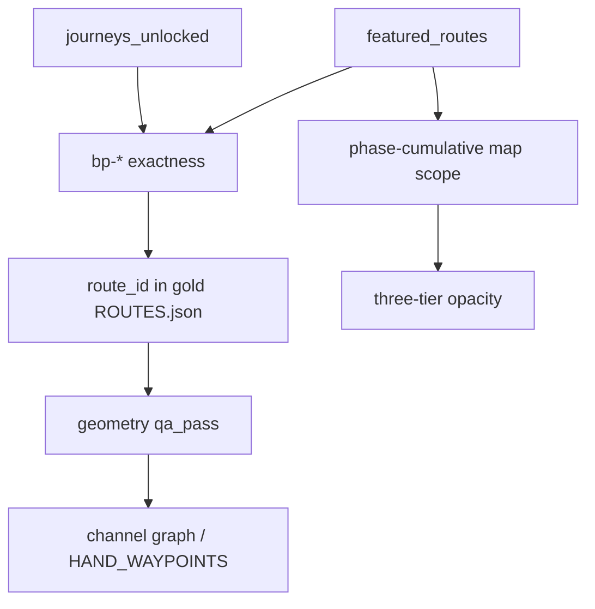

# Proposal credibility recovery — design & execution plan (2026-06-29)

**Status:** APPROVED — fix-first, UAE-led  
**Trigger:** AFK lane (`75403712`) dropped 281 proposal bindings and inserted 62 placeholder surfaces to pass deploy gates; UAE geometry not resealed  
**Principle:** **Fix → reseal → gate → mesh** — null beats wrong only when a corridor is provably ungroundable

---

## Problem statement

Partner proposal pages fail credibility on five layers that must align:

| Layer | Source | Current failure |
|-------|--------|-----------------|
| Narrative | `journeys_unlocked`, phase copy | Card labels ≠ sealed BP endpoints (`bp_binding`) |
| Proposal | `phases[].featured_routes` | 62 placeholder cards; 281 bindings dropped not fixed |
| Binding | `route_id` + `from_node_id`/`to_node_id` | Fuzzy relink passed linkage but not human exactness |
| Geometry | `ROUTES.json` story geometry | UAE routes stale (`_geometry_land_km` ≠ live QA); channel graphs unused |
| Render | `index.html` phase scoping | FE rules OK; data feeding them is wrong |

The AFK pass optimized **gate green** over **user-visible truth**.

---

## Locked decisions

| # | Decision |
|---|----------|
| 1 | **DROP is last resort** — requires `CORRIDOR-ENDPOINT-GROUNDING` ungroundable receipt or explicit `--allow-drop` |
| 2 | **Empty carousel > fake corridor** — no placeholder surfaces in production |
| 3 | **UAE first** — Careem/Noon/Yango/Bolt UAE before Grab SEA re-ground |
| 4 | **Live geometry is truth** — `evaluate_route()` post-mint; sync `_geometry_land_km` on route props |
| 5 | **§3.7 hard gate always on** — deploy fails on placeholders, REWRITE, S-tier bp/geometry errors |
| 6 | **Mesh/FE-2 after S-tier** — Phase 4 only when Phases 1–2 pass for reference + UAE |

---

## Tier taxonomy (proposal-visible)

| Tier | Criteria | Surfaces |
|------|----------|----------|
| **S** | Sealed `bp-*` pair + geometry `qa_pass` + phase-narrative fit + economics grounded | `journeys_unlocked`, `featured_routes`, map highlight |
| **A** | Geometry pass, phase-scoped, lower traffic | `featured_routes` only |
| **B** | Geometry pass | map context only |
| **H** | Ungroundable or geometry fail after fix attempt | omit / explicit roadmap chip |

**Caps:** ≤4 `journeys_unlocked`, ≤3 `featured_routes` per phase, ≤6 `signature_routes` per cluster brief.

---

## RE-GROUND decision tree (replaces DROP-first)

```
bp_binding flag?
├─ 1. Route endpoints correct, card labels wrong?
│     → Fix labels on journey/featured to match sealed BP labels
├─ 2. Card labels correct, route wrong?
│     → Re-link via CORRIDOR-ENDPOINT-GROUNDING + strict relink (bp-* required)
├─ 3. No gold route for correct bp pair?
│     → Mint story route (channel_solver) → ROUTES.json → bind
├─ 4. Listed in CORRIDOR-ENDPOINT-GROUNDING ungroundable?
│     → HOLD null (omit carousel; optional roadmap chip)
└─ 5. Phase-narrative misfit?
      → Move to correct phase or drop from featured only
```

---

## Five-layer credibility contract



**Front-end render contract** (already in `index.html`):
- Phase N shows cumulative `featured_routes` from phases 1…N only
- Opacity: current phase full · prior medium · mesh low
- Map lines must be geometry-passing story routes bound to proposal surfaces

---

## Phase 0 — Rollback policy debt

| Step | Action | Artifact |
|------|--------|----------|
| 0.1 | Restore Grab/Bolt/Rapido JSON from `a459f7f5` | `data-clean/partners/{grab,bolt,rapido}.json` |
| 0.2 | Remove 62 placeholder surfaces | same + `partner-pitch/` |
| 0.3 | Gate `apply_proposal_fidelity_from_audit.py` — default RE-GROUND; `--allow-drop` only | `scripts/apply_proposal_fidelity_from_audit.py` |
| 0.4 | Linkage audit: allow intentional null when `_fidelity_trim.intentional_null`; fail placeholders | `scripts/audit-partner-route-linkage.mjs` |

**Exit:** 0 placeholders · baseline restored · DROP gated

---

## Phase 1 — UAE credibility sprint (P0)

| Step | Work | Done when |
|------|------|-----------|
| 1.1 | UAE commercial pair list → `HAND_WAYPOINTS` | ~30–50 pairs, 3–8 waypoints each |
| 1.2 | `mint_story_channels.py --apply` on all UAE proposal-referenced story routes | Nikki Beach + Palm/Marina/Creek `qa_pass`; `_geometry_land_km` refreshed |
| 1.3 | Channel graphs in mint path (primary, not fallback) | Palm/Marina/AD island legs use graph waypoints |
| 1.4 | Tier 3 frond polygons (#79ah) | Intra-Palm routes pass without land cross |
| 1.5 | Fidelity `geometry_preview` uses live `evaluate_route()` | Audit and map agree |
| 1.6 | Visual QA `/careem`, `/noon`, `/yango/uae`, `/bolt` UAE | No spaghetti; Phase 1 = 3 exact corridors |

**Partners:** careem, noon, bolt (uae market), yango (uae market)

**Receipt:** `handoff/partner-map-model/UAE-CREDIBILITY-RECEIPT.json`

---

## Phase 2 — Reference partner RE-GROUND

| Partner | Scope | S-tier target |
|---------|-------|---------------|
| Careem/Noon | Nikki Beach + trims | **PASS** (0 flags) |
| Grab | ~114 `bp_binding` across SG, cross-border, Bali, Jakarta, Vietnam | ≤4 journeys · ≤3 featured/phase · 0 placeholders |
| Bolt | Multi-market binding + geometry | Same |
| Rapido | India corridors | Same |

**Tooling:** `scripts/reground_proposal_surfaces.py` (new) — decision tree automation + manual receipt per partner

**Receipt:** `handoff/partner-map-model/RE-GROUND-RECEIPT.json`

---

## Phase 3 — Extend audit + hard deploy gates

| Step | Action |
|------|--------|
| 3.1 | `audit_proposal_fidelity.py --all` (29 hubs → 62 partners) |
| 3.2 | §3.7 preflight always fails on: bp_binding S-tier errors · geometry >0.4km · placeholder `_link_source` · REWRITE on reference partners |
| 3.3 | `validate_partner_proposals.py` in deploy preflight |

**Exit:** Deploy aborts on any reference partner not PASS

---

## Phase 4 — Map layer (post S-tier)

| Step | Action |
|------|--------|
| 4.1 | `mint_intra_city_mesh.py --cities dubai-uae,abu-dhabi-uae,sharjah-uae` |
| 4.2 | FE-2 dedup ~193 referenced-copy groups |
| 4.3 | Global mesh geometry (~1,893 fails) — market batch |

**Receipt:** `handoff/partner-map-model/MESH-PHASE4-RECEIPT.json`

---

## Phase 5 — Economics hygiene

| Step | Action |
|------|--------|
| 5.1 | Caribbean `growth_case` reconcile (abc-islands → consolidated caribbean post-PR #95) |
| 5.2 | 756 pending economics corridors global triage (non-blocking metadata) |

**Receipt:** `handoff/partner-map-model/ECONOMICS-HYGIENE-RECEIPT.json`

---

## Ongoing controls

| Control | Enforces |
|---------|----------|
| Tier taxonomy S/A/B/H | Only S on proposal copy |
| §3.7 hard gate | Deploy blocks flags/placeholders/REWRITE |
| Linkage + fidelity in series | Existence then exactness |
| Live geometry source | `_geometry_land_km` = `evaluate_route()` |
| Visual QA checklist | 5 checks per reference partner page |

---

## Execution order

```
Phase 0 → Phase 1 (UAE) → Phase 2 (RE-GROUND) → Phase 3 (gates) → Phase 4 (mesh) → Phase 5 (economics) → deploy
```

---

## Success metrics

| Metric | AFK state | Target |
|--------|-----------|--------|
| Placeholder surfaces | 62 | 0 |
| Reference partner fidelity | PASS_WITH_FLAGS | **PASS** |
| Careem/Noon geometry flags | 2 (Nikki Beach) | 0 |
| Grab bp_binding errors | 114 (pre-fix) | 0 |
| §3.7 deploy gate | Advisory | **Hard fail** |
| UAE proposal routes resealed | 0 | All referenced routes |

---

*Approved 2026-06-29 — supersedes AFK shortcut lane; fix-first replaces drop-first*